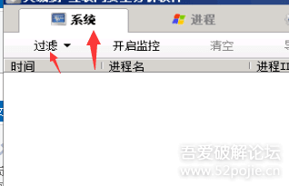
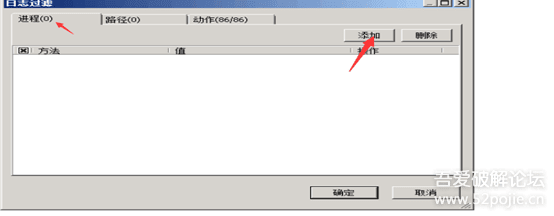
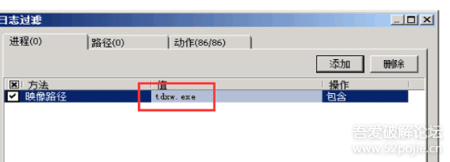
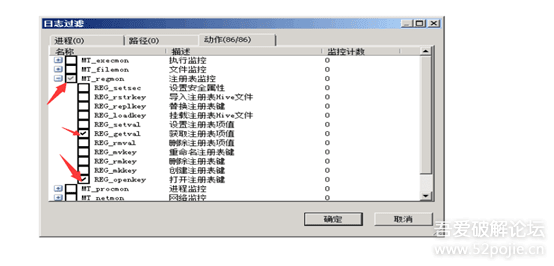
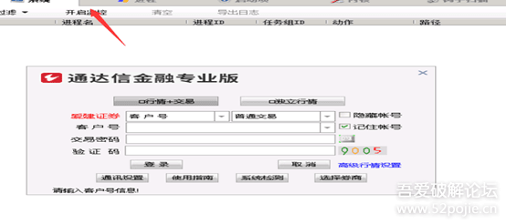
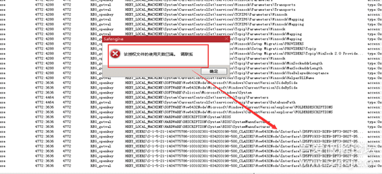
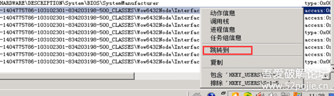
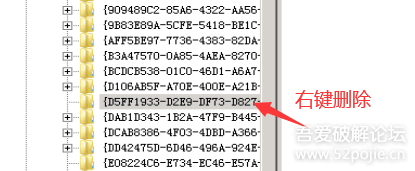

# 删除注册表简单破解加 se 天数限制的某通达信 dll 公式

1. 系统-过滤-进程  
   
2. 然后添加进程 因为是监控通达信，所以填写通达信的进程 tdxw.exe  
   
   

3. 添加好进程后开始加动作因为只需要监控注册表选注册表 选中那两个  
   

4. 然后这个时候打开有那个 dll 的通达信程序  
   注意先打开主程序再开那个火绒剑的监控开启监控后再点主程序的行情登录  
   

5. 注意 这里停住了 最后这个注册表的地方就是信息 删除它
   
   
   

6. 然后关闭程序，重新打开通达信成功进入！
